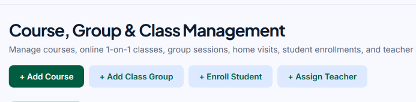
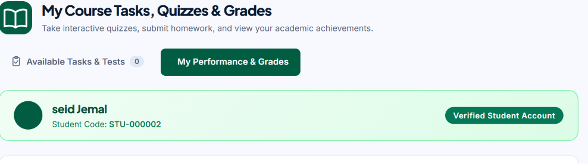
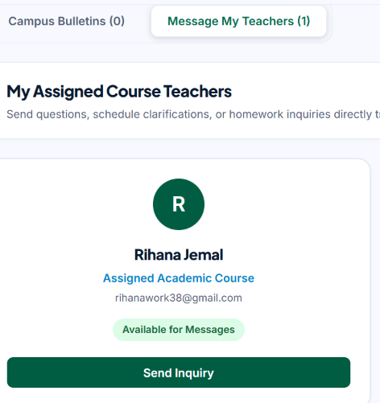
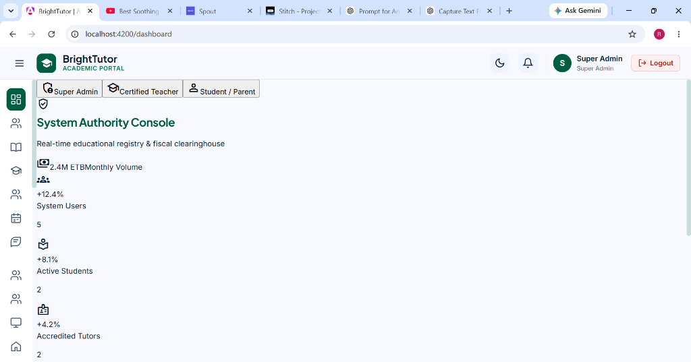
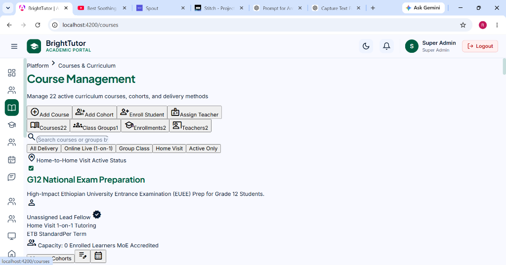
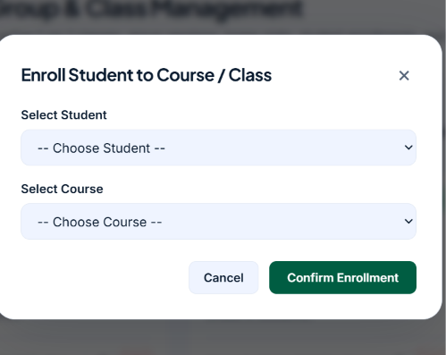
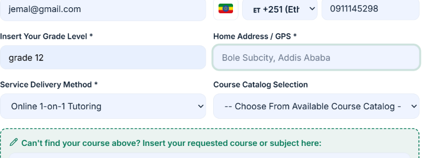
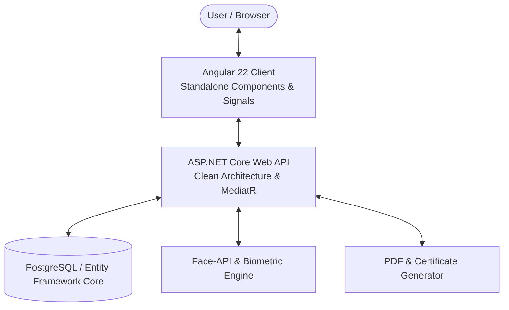

# 🎓 BrightTutor Academic Portal

> **Comprehensive Ethiopian K-12 STEM Academic Management & Tutoring Clearinghouse Platform**

[](https://angular.dev/)
[](https://dotnet.microsoft.com/)
[](https://blog.cleancoder.com/uncle-bob/2012/08/13/the-clean-architecture.html)
[](LICENSE)
[](https://github.com/Rihana-Jemal-2026/BrightTutor)

---

## 📌 Executive Overview

**BrightTutor** is a state-of-the-art educational management portal engineered for Ethiopian secondary STEM cohorts, home tutoring networks, and institutional academic governance. Built directly in alignment with Ministry of Education (MoE) curriculum standards, BrightTutor streamlines candidate admissions, facial biometric attendance, automated QR check-ins, automated ETB payroll clearing, weighted academic gradebooks, and digital certificate verification.

---

## 📸 Complete Visual Tour & Page Screenshots

### 1. Student Self-Registration & Admission Portal
The Student Admission Portal enables Grade 9-12 STEM candidates across Ethiopia to register online, select learning delivery methods (Home Visit 1-on-1, Live Online Classes, or Group Cohorts), and receive unique student identification codes.


*Figure 1.1: Student Admission Form capturing candidate details, village location, grade level, and tutoring preferences.*


*Figure 1.2: Instant admission confirmation modal with generated student ID code and portal credentials.*

---

### 2. Teacher Screening & Application Portal
Educator onboarding and screening workflow capturing academic qualifications, specialization subjects, degree uploads, CV documents, and background check statuses.


*Figure 2.1: Teacher Application Portal capturing personal information, university background, and teaching experience.*


*Figure 2.2: Subject specialization selector, tutoring service preferences, and wage expectations.*


*Figure 2.3: Verification document attachment portal for academic degrees, certifications, and government ID.*

---

### 3. Executive System Authority Console (Admin Portal)
Central administrative command center providing real-time telemetry over system usage, tuition revenue clearinghouse in Ethiopian Birr (`ETB`), tutor allocations, and platform configuration.


*Figure 3.1: Executive Dashboard showing total active students, tutor metrics, ETB revenue summaries, and quick action shortcuts.*


*Figure 3.2: Course & Curriculum Management catalog for Grade 9-12 Ethiopian University Entrance Exam (EUEE) prep courses.*


*Figure 3.3: Administrative Teacher Assignment matrix matching vetted educators to specific student cohorts and home visit schedules.*

---

### 4. Student Portal & Learning Dashboard
Personalized student portal giving learners access to their enrolled courses, daily class schedules, assignment submissions, attendance history, and grade reports.


*Figure 4.1: Student Portal Overview featuring upcoming class notifications, active courses, and tutor details.*


*Figure 4.2: Course progress tracker, lesson completion stats, and downloadable study materials.*

---

### 5. Teacher Portal & Classroom Management Console
Dedicated workspace for tutors to manage assigned student cohorts, record lesson progress, mark attendance, conduct online quizzes, and enter weighted grades.


*Figure 5.1: Teacher Dashboard displaying active class rosters, student attendance metrics, and quick gradebook entry.*

---

### 6. Academic Assessments & Gradebook Matrix
Automated MoE weighted gradebook engine supporting quiz administration, assignment grading, midterms, and final exam calculations.


*Figure 6.1: Academic Assessment Gradebook with MoE weighted formula calculation and export capabilities.*

---

### 7. Digital Certificate Authority & Accreditation
High-resolution vector diploma generation for 3-month course completion and 1-year tutor service awards, equipped with SHA-256 cryptographic hashes and verification QR codes.


*Figure 7.1: Official 3-month completion diploma with security border, signature authorization, and vector QR code.*


*Figure 7.2: Public verification modal validating certificate authenticity, recipient identity, and issue timestamp.*

---

### 8. Biometric Attendance & Financial Clearinghouse
Integrated facial liveness detection scanner and Ethiopian Birr (`ETB`) tuition payment approval system.


*Figure 8.1: AI-powered facial biometric attendance verification using live web camera feed.*


*Figure 8.2: Ethiopian Birr (ETB) tuition payment clearinghouse, bank slip verification, and automated invoice approval.*

---

## 🏛️ System Architecture & Clean Architecture Directory Structure

### High-Level Component Flow


### Backend Clean Architecture Directory Structure
The backend repository is organized following strict **Clean Architecture** separation of concerns:

```
backend/
├── BrightTutor.slnx
├── src/
│   ├── BrightTutor.Api/                # Presentation Layer (Controllers, Middleware, Swagger)
│   ├── BrightTutor.Application/        # Application Layer (CQRS Commands, Queries, MediatR, DTOs)
│   ├── BrightTutor.Domain/             # Domain Layer (Entities, Enums, Value Objects, Domain Logic)
│   ├── BrightTutor.Infrastructure/     # Infrastructure Layer (EF Core DbContext, Auth, Migrations)
│   └── BrightTutor.LivenessChecks/     # System Health Telemetry & Diagnostic Probes
└── tests/
    ├── BrightTutor.UnitTests/          # xUnit Domain & Application Unit Tests
    └── BrightTutor.IntegrationTests/   # xUnit API Controller & Infrastructure Integration Tests
```

---

## 💻 Technology Stack

| Layer | Technologies & Tools |
| :--- | :--- |
| **Frontend Framework** | Angular 22, TypeScript 6.0, RxJS, Angular Signals, Modern SCSS |
| **Backend Architecture** | .NET 8.0 C#, ASP.NET Core Web API, Clean Architecture, MediatR (CQRS) |
| **Data Persistence** | Entity Framework Core 8.0, PostgreSQL |
| **Biometrics & Rendering** | `@vladmandic/face-api`, `html2canvas`, `jsPDF`, `qrcode` |
| **Testing Suite** | xUnit, Microsoft.NET.Test.Sdk, Coverlet |
| **Design System** | Google Material Symbols Outlined, Custom CSS Tokens, Glassmorphism |
| **Financial Clearing** | Ethiopian Birr (`ETB`) |

---

## 🛠️ Installation & Local Setup

### Prerequisites
* **Node.js**: `v20.x` or higher
* **npm**: `v10.x` or higher
* **.NET SDK**: `8.0` / `10.0`
* **PostgreSQL / SQL Database**: Running instance configured in `appsettings.json`

### 1. Backend Setup (.NET Core API)
```bash
# Navigate to backend folder
cd backend

# Restore dependencies across all Clean Architecture projects
dotnet restore

# Build backend solution
dotnet build

# Run unit and integration tests
dotnet test

# Launch API server
cd src/BrightTutor.Api
dotnet run
```
> Server will start at `http://localhost:5198` (Swagger UI available at `http://localhost:5198`).

### 2. Frontend Setup (Angular Client)
```bash
# Navigate to frontend client folder
cd frontend/brighttutor-client

# Install frontend packages
npm install

# Start Angular dev server
npm start
```
> Portal will be accessible at `http://localhost:4200`.

---

## 📜 License & Copyright

Designed and developed for **BrightTutor Academy** & MoE Secondary STEM Program.  
All Rights Reserved © 2026.
